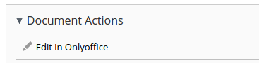
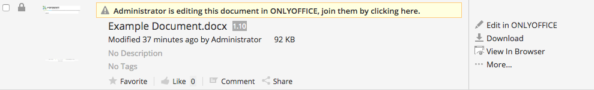
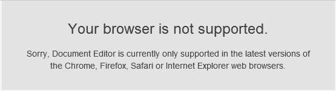
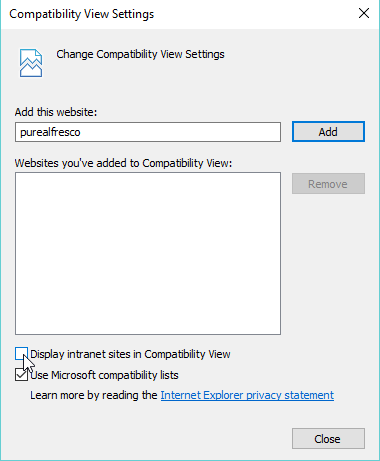

# Alfresco ONLYOFFICE integration

This Share plugin enables users to edit and preview Office documents within ONLYOFFICE from Alfresco Share. This will create a new **Edit in ONLYOFFICE** action within the document library for Office documents. This allows multiple users to collaborate in real time and to save back those changes to Alfresco.

Tested with Enterprise 5.0.\*, 5.1.\*, 5.2.\* and Community 5.1.\*, 5.2.\*
Version 2.0.0 tested only with Community 6.1 (java 11)

## Features

* Creates a new **Edit in OnlyOffice** Action within the document library for office documents.
* Allows multiple users to collaborate in real time and save back changes to Alfresco.
* Web Preview for Excel, Powerpoint and Word documents replacing the default PDF view.
* Transformation of Excel, Powerpoint and Word documents to PDF using OnlyOffice.

## Usage

### Realtime Collaboration

* Navigate to an Office Document such as a word document within Alfresco Share.
* Select the `Edit in Onlyoffice` action:



* This will lock the document in Alfresco until you are finished, but leaving the `Edit in OnlyOffice` action available for other users:


* If a Document is being edited by someone else, you can join them by clicking on the banner above the document, or by clicking the `Edit in OnlyOffice` action:




### Web Preview

Web preview of documents replaces the default pdfjs viewer in Alfresco.  This is a much more usable experience for documents such as excel spreadsheets and powerpoint presentations.

This is an automatic feature, and will display the preview for the following document types by extension:

* Word: docx, docm, dotx, dotm, doc
* Excel: xlsx, xlsm, xlt, xls
* Powerpoint: pptx, pptm, potx, potm, ppt


### Transformation

Transformation is also automatic, and will replace the default transformer for the following file type combinations:

* docx to pdf
* doc to pdf
* pptx to pdf
* ppt to pdf
* xlsx to pdf
* xls to pdf

## Compiling

You will need:

* Java 8 SDK or above

* Gradle

* Run `gradle amp` from the `share` and `repo` directories

## Installation

### ONLYOFFICE

You will need an instance of ONLYOFFICE that is resolvable and connectable both from alfresco and any end clients. ONLYOFFICE must also be able to POST to alfresco directly.

The easiest way to start an instance of ONLYOFFICE is to use Docker: https://github.com/ONLYOFFICE/Docker-DocumentServer

### Alfresco

* Deploy the amp to both the repo and share end using alfresco-mmt or other methods

* Add the `onlyoffice.url` property to alfresco-global.properties:
  ```
  onlyoffice.url=http://documentserver/
  ```

*  OnlyOffice will make the connection to Alfresco on behalf of the client, so OnlyOffice needs to be able to talk to Alfresco.  In order for OnlyOffice to do this, Alfresco needs to generate what it thinks the external URL is.  Make sure that the following properties are set correctly in `alfresco-global.properties`

  ```
  alfresco.protocol=http
  alfresco.host=alfresco.yourcompany.local
  alfresco.port=8080
  alfresco.context=alfresco
  ```

* The integration uses a HMAC-SHA256 token based system to communicate to Alfresco from OnlyOffice.  This connection used to use the user's alf_ticket value, but was found to be unreliable, and would reset if the sessions are flushed.  The secret token is generated based upon the hostname of the server, but can be explicitly set in the global properties:
  ```
  onlyoffice.token=<Secret Token here>
  ```

* (Optional) set the default language that the editor will use.  By default the document editor should pick up the language of the browser, so it doesn't always need to be set.

  ```
  onlyoffice.lang=en
  ```

* (Optional) set another URL to use for PDF transformations.  By default when converting files to PDF it will use the `onlyoffice.url`:

  ```
  onlyoffice.transform.url=http://documentserver/
  ```
* (Optional) if the office documents in your environment are very large, some browsers can struggle to render them with the web preview.  Document sizes and content values can be thresholded, so the preview will not appear above the threshold.  This feature is not turned on by default. You can adjust the thresholds of various documents by editing the following values:
  ```
  onlyoffice.preview.document.size.threshold=10485760
  onlyoffice.preview.docx.threshold=8000
  onlyoffice.preview.doc.threshold=8000
  onlyoffice.preview.xlsx.threshold=10000
  onlyoffice.preview.xls.threshold=10000
  onlyoffice.preview.pptx.threshold=1000
  onlyoffice.preview.ppt.threshold=1000
  ```

## How it works

The ONLYOFFICE integration follows the API documented here https://api.onlyoffice.com/editors/basic:

* User navigates to a document within Alfresco Share and selects the `Edit in ONLYOFFICE` action.
* Alfresco Share makes a request to the repo end (URL of the form: `/parashift/onlyoffice/prepare?nodeRef={nodeRef}`).
* Alfresco Repo end prepares a JSON object for Share with the following properties:
  * **docUrl**: the URL that ONLYOFFICE uses to download the document (includes the `alf_ticket` of the current user),
  * **callbackUrl**: the URL that ONLYOFFICE informs about status of the document editing.  This uses the username + secret token HMAC-SHA256 checksum, rather than normal authentication.
  * **onlyofficeUrl**: the URL that the client needs to talk to ONLYOFFICE (given by the onlyoffice.url property),
  * **key**: the UUID+Modified Timestamp to instruct ONLYOFFICE whether to download the document again or not,
  * **docTitle**: the Title (name) of the document.
* Alfresco Share takes this object and constructs a page from a freemarker template, filling in all of those values so that the client browser can load up the editor.
* The client browser makes a request for the javascript library from ONLYOFFICE and sends ONLYOFFICE the docEditor configuration with the properties as above.
* ONLYOFFICE then downloads the document from alfresco and the user begins editing.
* ONLYOFFICE sends a POST request to the callback URL to inform Alfresco that a user is editing the document.
* Alfresco locks the document, but still allows other users with write access the ability to collaborate in real time with ONLYOFFICE by leaving the Action present.
* When all users and client browsers are finished, they close the editing window.
* After 10 seconds of inactivity, ONLYOFFICE sends a POST to the callback URL letting Alfresco know that the clients have finished.
* Alfresco downloads the new version of the document, replacing the old one.

## Troubleshooting

When user wants to edit a document via `Edit in OnlyOffice`, the opened document editor window may not be loaded due to Internet Explorer compatibility feature is enabled, which cause some methods that only exist in higher version of IE are not available. If an error message `Object doesn't support property or method 'trim'` can be found in developer console of IE (press F12 then go to `Console` tab) or error message as shown below is seen, you need to disable the compatibility view settings in IE:



You can change the `Compatibility View Settings` in IE by choosing the compatibility view settings menu items as shown below, the menu will show up by clicking gear on right top corner of browser:


Uncheck the `Display intranet sites in Compatibility View` option, click close.



Refresh the page if editor is not auto-loaded, then you should be able to edit document in OnlyOffice document editor.

